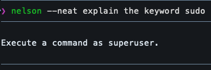
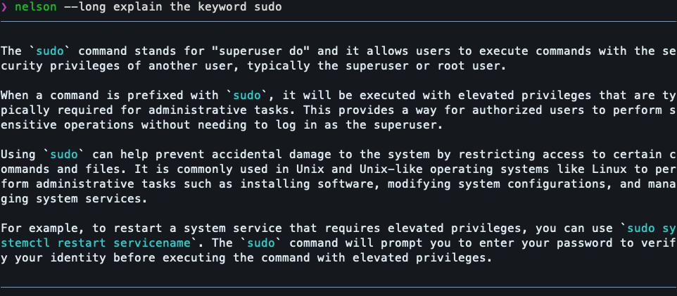
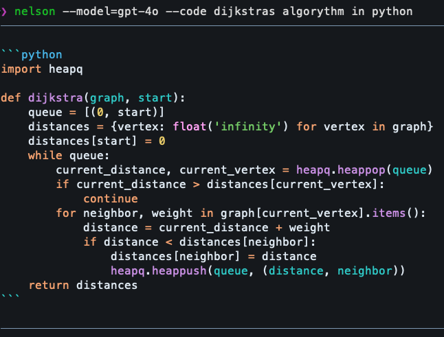
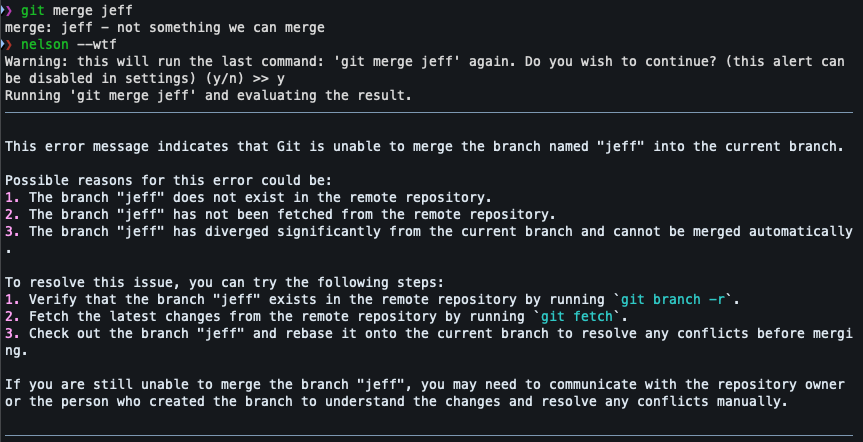

# nelson-cli
Nelson-cli is a Unix Command Line Tool written in Bash that allows for AI suggestions, error explanations, and more, all straight from the terminal. Currently using OpenAI API (because that's what I know), planning to move into an open source, local LLM in the future. 

---

## Important
This tool uses OpenAI's ChatGPT models to generate responses via their API. In order to use this tool, you need to have a valid API key. **If you want to test out the tool, feel free to send me a message on Discord @sawsent , I might be able to provide one**.

---

## Dependencies
#### Required:
- [jq](https://github.com/jqlang/jq) <br>
#### Recommended:
- [bat](https://github.com/sharkdp/bat)

---

## Instalation
### Step 0: install dependencies with your favorite package manager
### Step 1: clone repo wherever you'd like
```sh
git clone https://github.com/sawsent/nelson-cli
```
### Step 2: add your OpenAI key, folder location, and command alias to your shell config file
```sh
# .zshrc / .bashrc / .profile / ...
export OPENAI_API_KEY="your-openai-key"
export NELSON_LOCATION="path/to/nelson-cli"
alias nelson="$NELSON_LOCATION/main.sh"
```
### Step 3: Change shell HISTFILE in [settings.sh](settings.sh)
1. Find out where you Command History file is located
```sh
echo $HISTFILE
# My output: /Users/vicente.figueiredo/.zhistory
``` 
2. Replace in [settings.sh](settings.sh)
```sh
# setings.sh

# because we're using bash to run the script, it might be different than your main zsh or fish $HISTFILE (I think) 
export HISTFILE="/Users/vicente.figueiredo/.zhistory" # <- replace with your $HISTFILE
```
### Step 4: Make the script executable! 
You need to source your shell config file to access $NELSON_LOCATION
```sh
chmod +x $NELSON_LOCATION/main.sh
```

---

## Usage
You can use this tool for as many reasons as you want. It's very easy to extend the functionality with custom system prompts and/or aliases. 

### Core features:
1. Choose the model you want to use for the specific request _(ex: `--model=gpt-4o`)_
2. Choose temperature you want to use _(ex: `--temp=0.5`)_
3. Choose the max tokens you want to use _(ex: `--max-tokens=100`)_
4. Choose the mode (System Prompt) to use with `--\<mode>`
5. **NEW:** Choose a one-time System Prompt with `--system-prompt="Custom Prompt"`
6. **NEW:** Ask nelson to explain the last error with `nelson --wtf`
7. You can obviously change all defaults (see [settings.sh](settings.sh))
8. Commands run and OpenAI responses (the whole JSON response) can be stored in an [output.log](./output.log) file

### Core modes 
(i didn't check if nelson was right btw, and Im using bat with some style opts for the output (see [settings.sh](./settings.sh)))

1. **--neat (-n):** Answers in the most concise way possible


2. **--long (-l):** Explains in more detail


3. **--code:** Simply codes what's requested. No comments and no explanations


4. **--command (-com):** Provides a Shell command based on the given parameters


---

### Nelson, wtf???
You can ask for clarification on your last command run by simply running `nelson --wtf`.


### Customizability
You can easily change defaults, how the code is printed to the terminal in [settings.sh](./settings.sh). 

You can also easily add more modes (System Prompts) in the [system_prompts.sh](./system_prompts.sh). Simply follow the pattern that's already there!

```sh
case $1 in
  default)
    echo "$DEFAULT_SYSTEM_PROMPT"
    ;;
  # ...
  # ...
  your-custom-mode)
    echo "Your Custom System Prompt"
    ;;
  # ...
```

Once you do that, it will immediatly be available to use!
```sh
nelson --your-custom-mode Your question for nelson
```
(Keep in mind, you cant use any names that have already been defined as flags like --debug, --max-temperature, etc...). These take precedence in the flag hierarchy (they're evaluated first in the case block)

---

## Upcoming
- [x] **Add A Way to override system prompts directly in the command line**: Instead of having to modify [system_prompts.sh](./system_prompts.sh), you can simply do `nelson --system-prompt="Custom System Prompt" question` for occasional System Prompt needs.
- [x] **Add Context Support** (ex: `nelson --explain-error` / `nelson --wtf`): Automatically sends the last command run and the output for nelson to explain.
- [ ] **Migrate / add support for locally-hosted LLMs (like Llama):** I have an API key because I put 10€ on a project once, but not everyone does so it would be better if you could use other APIs and self-hosted LLMs.

